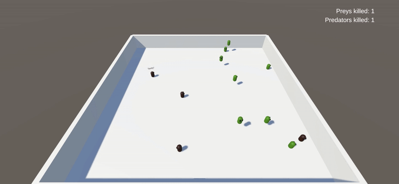

# Prey and Predator Simulation

This is a prey and predator simulation implemented in **Unity 2022.3.26f1**.


## Animals

Currently, there are two types of animals implemented:

- **Snake**: A predator that slithers around and eats preys.
- **Frog**: A prey that jumps around.

## Settings

Simulation settings can be found in the `Assets/Configs` folder.

## Entry Point

The main entry points of the simulation are:

- `ZooWorldInstaller.cs`
- `EntryPoint.cs`

## Used Plugins

This project utilizes the following plugins:

- [Zenject](https://github.com/modesttree/Zenject) – Dependency Injection framework for Unity.
- [Addressables](https://docs.unity3d.com/Manual/com.unity.addressables.html) – Asset management system.
- [UniTask](https://github.com/Cysharp/UniTask) – Async/Await integration for Unity.
- [DOTween](https://dotween.demigiant.com/) – Animation and tweening library for Unity.

## Installation

1. Clone this repository:
   ```sh
   git clone https://github.com/Arenooo/zoo-world.git
   ```
2. Open the project in **Unity 2022.3.26f1**.
